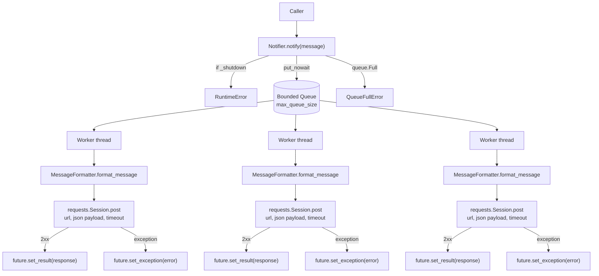
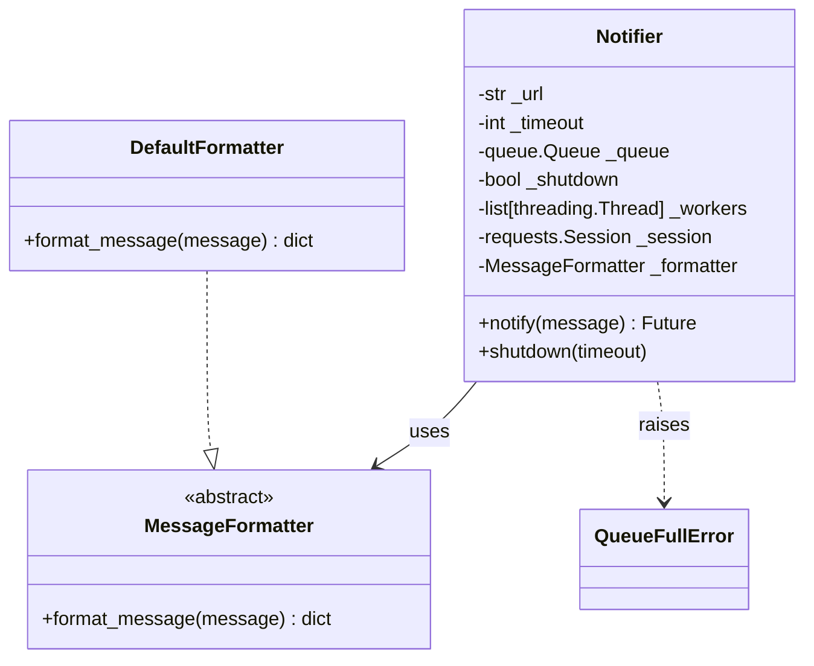
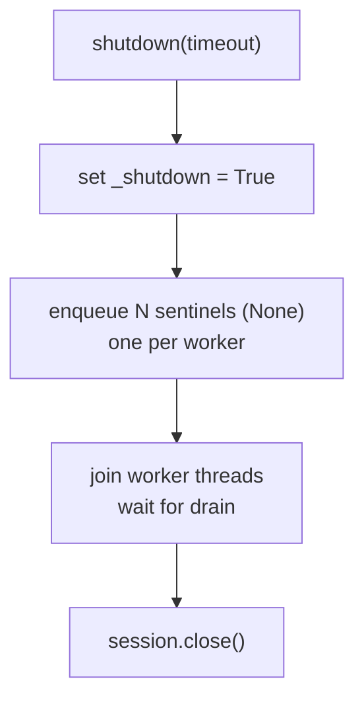

# Architecture

## High-level overview

```mermaid
flowchart TD
    C[Caller] --> N["Notifier.notify(message)"]

    N -->|"if _shutdown"| RTE[RuntimeError]
    N -->|"put_nowait"| Q[("Bounded Queue<br/>max_queue_size")]
    N -->|"queue.Full"| QFE[QueueFullError]

    Q --> W1["Worker thread"]
    Q --> W2["Worker thread"]
    Q --> Wn["Worker thread"]

    W1 --> F1["MessageFormatter.format_message"]
    W2 --> F2["MessageFormatter.format_message"]
    Wn --> Fn["MessageFormatter.format_message"]

    F1 --> P1["requests.Session.post<br/>url, json payload, timeout"]
    F2 --> P2["requests.Session.post<br/>url, json payload, timeout"]
    Fn --> Pn["requests.Session.post<br/>url, json payload, timeout"]

    P1 -->|"2xx"| OK1["future.set_result(response)"]
    P1 -->|"exception"| E1["future.set_exception(error)"]
    P2 -->|"2xx"| OK2["future.set_result(response)"]
    P2 -->|"exception"| E2["future.set_exception(error)"]
    Pn -->|"2xx"| OKn["future.set_result(response)"]
    Pn -->|"exception"| En["future.set_exception(error)"]
```

## Components

```mermaid
classDiagram
    class Notifier {
        -str _url
        -int _timeout
        -queue.Queue _queue
        -bool _shutdown
        -list[threading.Thread] _workers
        -requests.Session _session
        -MessageFormatter _formatter
        +notify(message) Future
        +shutdown(timeout)
    }

    class MessageFormatter {
        <<abstract>>
        +format_message(message) dict
    }

    class DefaultFormatter {
        +format_message(message) dict
    }

    class QueueFullError

    Notifier --> MessageFormatter : uses
    DefaultFormatter ..|> MessageFormatter
    Notifier ..> QueueFullError : raises
```

## Shutdown sequence

```mermaid
flowchart TD
    S["shutdown(timeout)"] --> A["set _shutdown = True"]
    A --> B["enqueue N sentinels (None)<br/>one per worker"]
    B --> C["join worker threads<br/>wait for drain"]
    C --> D["session.close()"]
```
